# React Data Flow의 이해

## Redux

만든 사람 : Dan Abramov, Kent C. Dodds 

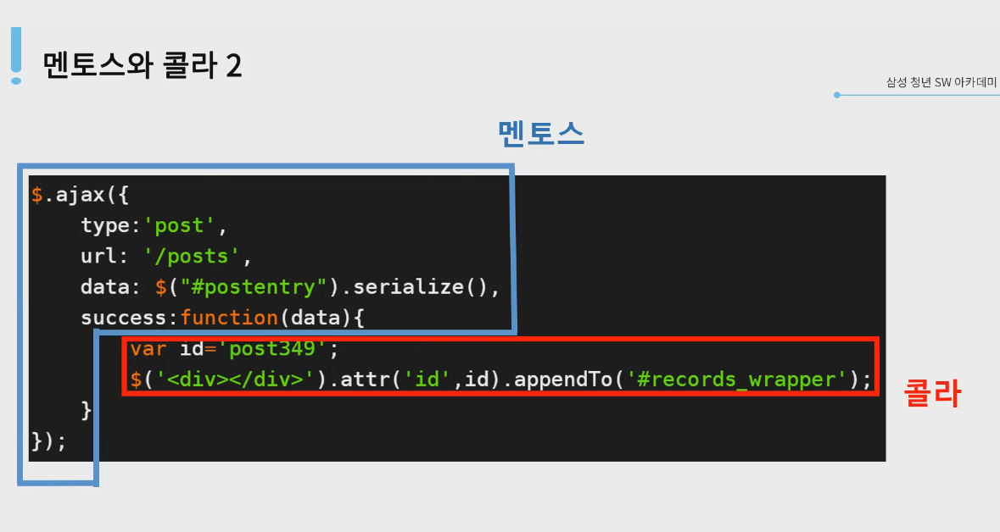

- 멘토스 : 비동기 코드
- 콜라 : 상태변화 변화 코드

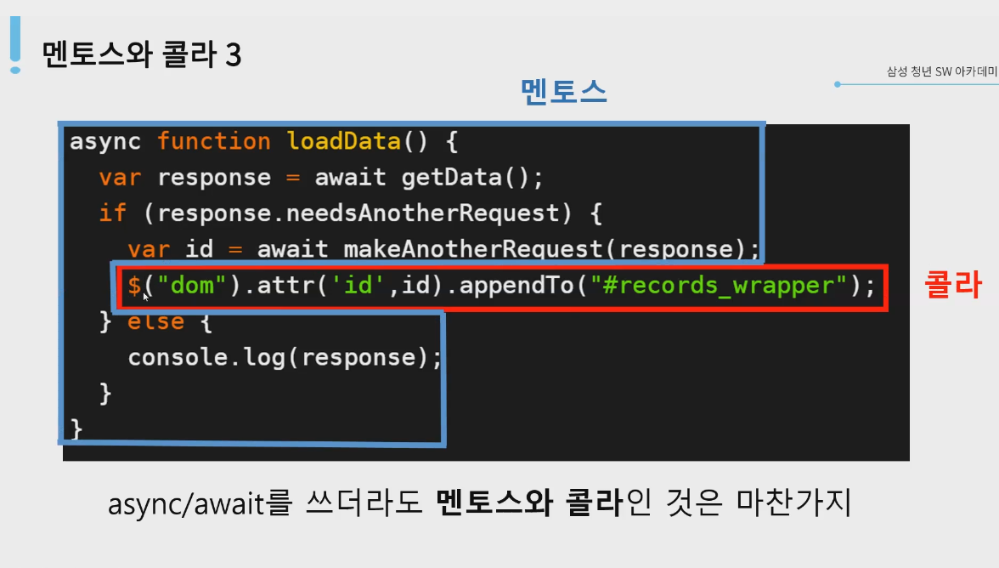

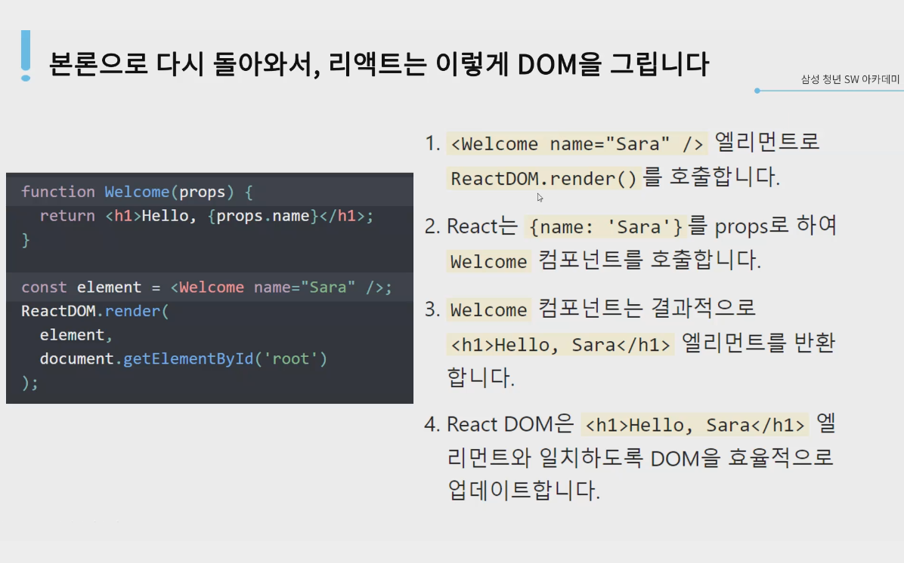

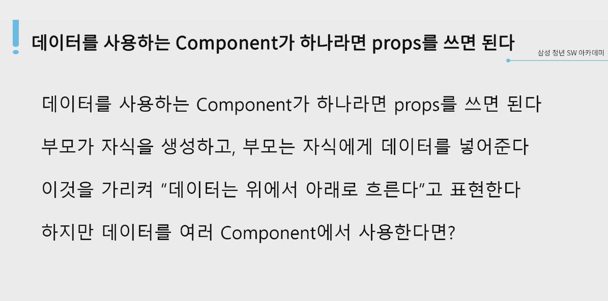

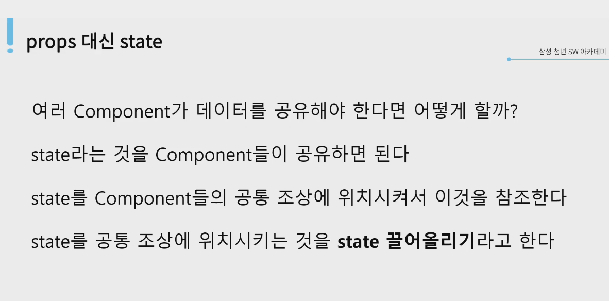

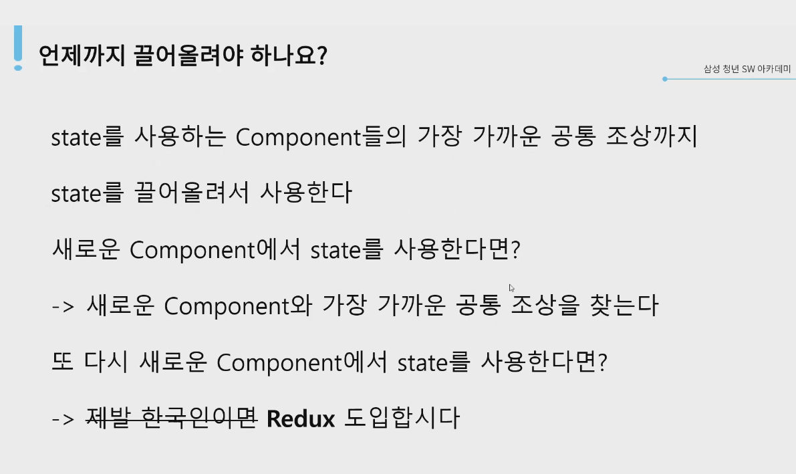

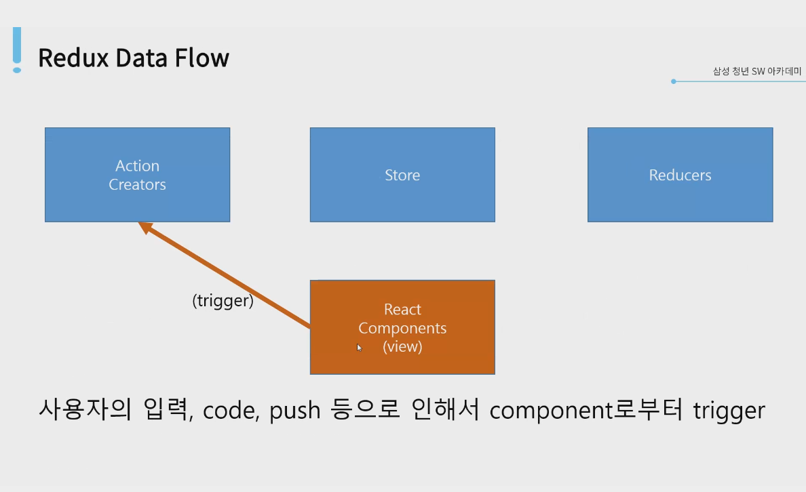

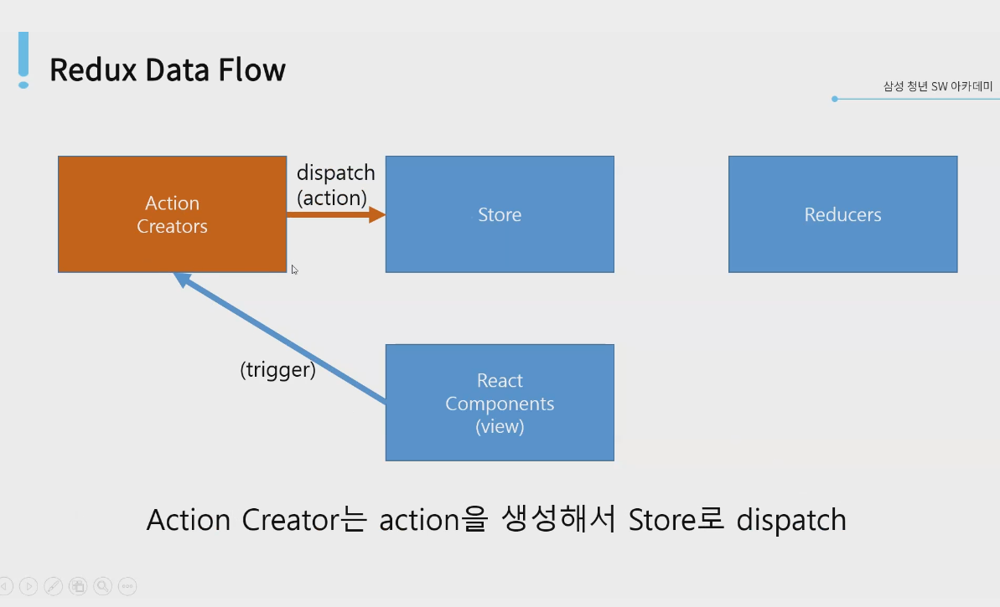

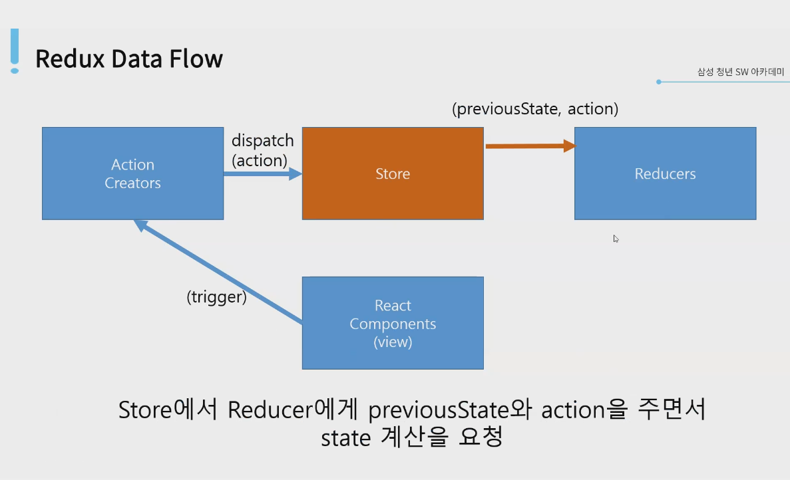

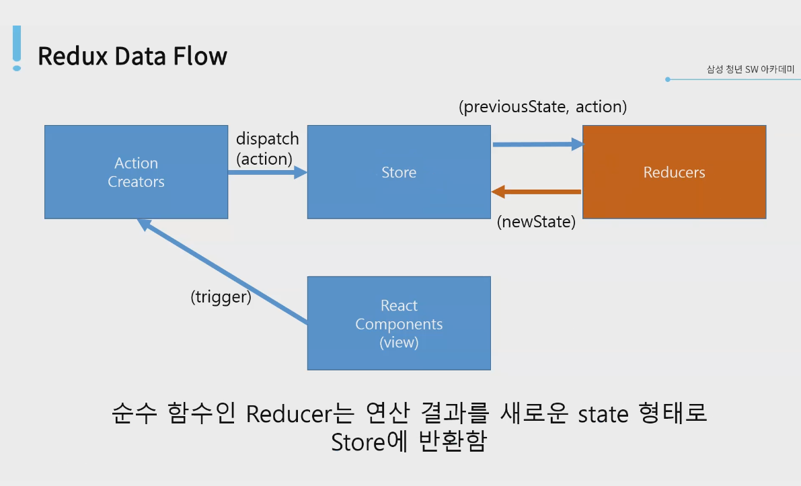

- 순수 함수 : 어떤 파라미터를 넣어도 리턴해주는 상태가 항상 동일.
- 리듀서는 놀랍게도 맵 리듀스와 비슷한 그것이 맞음

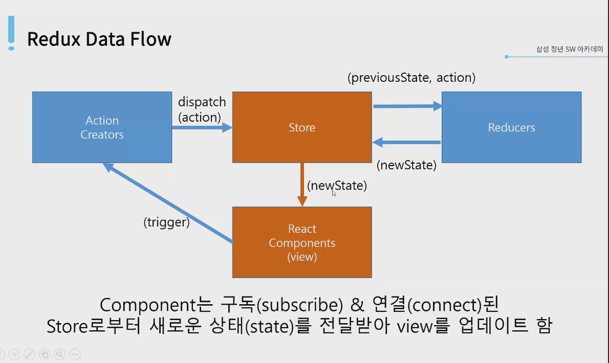

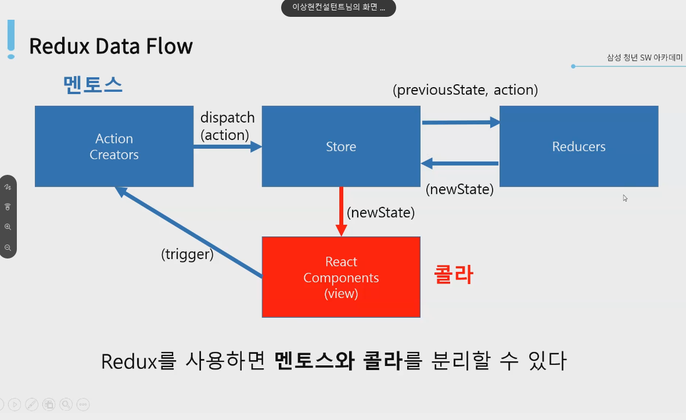

- 한번에 이해할 수는 없다

- 전체 플로우를 한번 살펴보고 부분에 대한 이해로 넘어가자

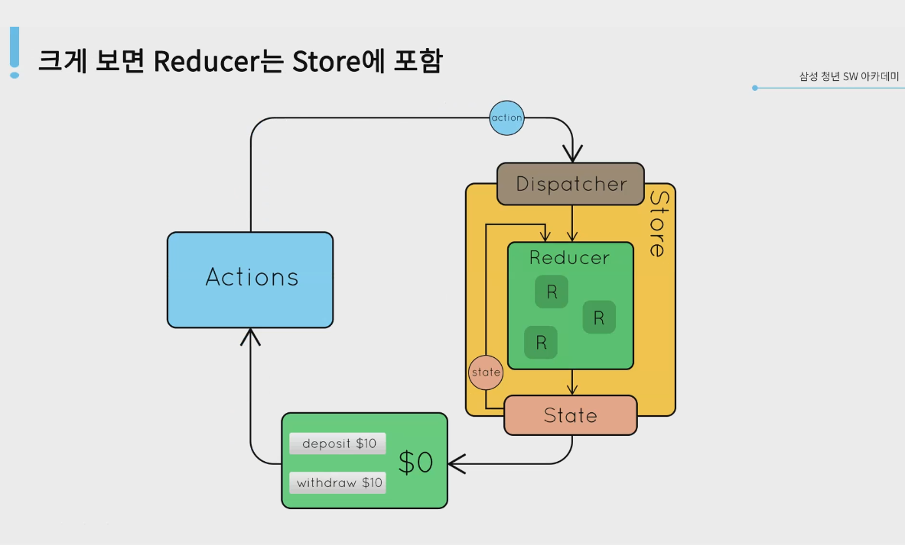

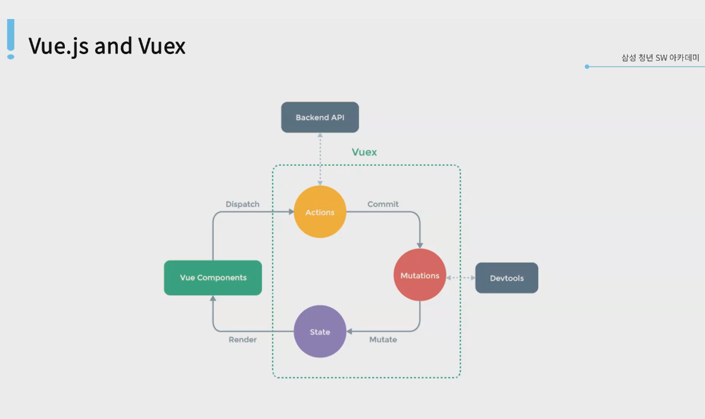

뷰.js 와 뷰엑스는 리액트에 비해 단계가 간략화되어있고(리듀서가 없음) 좀더 간단하지만 비슷한 flow를 가지고 있다.